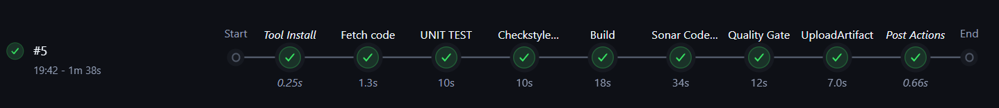

# Jenkins Configuration and Pipeline Setup

This guide covers the post-provisioning configuration of **Jenkins**: installing required tools, plugins, setting up integrations with SonarQube, Nexus, and Slack, and creating the CI pipeline using the provided `Jenkinsfile`.

Access Jenkins at: **http://192.168.33.13:8080**



## Initial Jenkins Setup

1. Open Jenkins in your browser.
2. Retrieve the initial admin password (displayed during `vagrant up` or run inside the VM):

```bash
sudo cat /var/lib/jenkins/secrets/initialAdminPassword
```

3. Complete the "Unlock Jenkins" step, install the suggested plugins, and create an admin user (recommended).
4. Note the Jenkins URL as `http://192.168.33.13:8080` (use this for webhooks if needed).

## Install and Configure Tools

Go to **Manage Jenkins → Tools**

Add the following tools:

### JDK Installation
- Name: `JDK17`
- Install automatically: Check
- Version: AdoptOpenJDK 17 (HotSpot)

### Maven Installation
- Name: `MAVEN3.9`
- Install automatically: Check
- Version: Apache Maven 3.9.x (latest available)

These tools are referenced in the pipeline via:

```groovy
tools {
    maven "MAVEN3.9"
    jdk "JDK17"
}
```

## Required Plugins

Go to **Manage Jenkins → Plugins → Installed** (or install via Available tab if missing)

Ensure the following plugins are installed:

- **Nexus Artifact Uploader**
- **SonarQube Scanner**
- **Pipeline Maven Integration**
- **Build Timestamp**
- **Pipeline Utility Steps**
- **Slack Notification Plugin** (for Slack integration)

## Configure SonarQube Server

1. Go to **Manage Jenkins → System → SonarQube servers**
2. Add a new server:
   - Name: `sonarserver`
   - Server URL: `http://192.168.33.12` (Nginx proxy on port 80)
   - Server authentication token: Generate a token in SonarQube (see [sonarqube.md](./sonarqube.md))
3. Add the token as a Secret Text credential in Jenkins (used automatically by `withSonarQubeEnv`).

## Nexus Credentials

1. In Nexus, create or use admin credentials (default: `admin` / `admin123` — change it!).
2. In Jenkins: **Manage Jenkins → Credentials → System → Global credentials**
3. Add a new credential:
   - Kind: Username with password
   - Scope: Global
   - Username: `admin` (or your Nexus user)
   - Password: Nexus password
   - ID: `nexuslogin` (exactly this ID — used in pipeline)

## Slack Integration

1. In Slack, create an Incoming Webhook for your channel (e.g., `#all-m7md`).
2. Copy the webhook URL.
3. In Jenkins: **Manage Jenkins → System → Slack**
   - Configure:
     - Team Subdomain: (if needed)
     - Integration Token Credential: Add as Secret Text (or use global config)
     - Default channel: `#all-m7md`
4. The pipeline uses built-in `slackSend` with color mapping for SUCCESS (good) / FAILURE (danger).

## Create the Pipeline Job

1. New Item → Pipeline
2. Name: `vprofile-ci` (or any name)
3. Pipeline definition: **Pipeline script from SCM**
4. SCM: Git
   - Repository URL: `https://github.com/your-repo/your-jenkins-lab-repo.git` (or local if testing)
   - Branches: `*/main` (or appropriate)
   - Script Path: `scripts/Jenkinsfile`

Alternatively, for quick testing, paste the `Jenkinsfile` content directly into the pipeline script section.

## Key Parts of the Jenkinsfile

### Tools and Checkout
```groovy
tools {
    maven "MAVEN3.9"
    jdk "JDK17"
}
stage('Fetch code') {
    steps {
        git branch: 'atom', url: 'https://github.com/hkhcoder/vprofile-project.git'
    }
}
```

### Build and Test
```groovy
stage('UNIT TEST') { sh 'mvn test' }
stage('Checkstyle Analysis') { sh 'mvn checkstyle:checkstyle' }
stage('Build') { sh 'mvn install -DskipTests' }
```

### SonarQube Analysis and Quality Gate
```groovy
withSonarQubeEnv('sonarserver') {
    sh '''${scannerHome}/bin/sonar-scanner ...
}
stage("Quality Gate") {
    timeout(time: 1, unit: 'HOURS') {
        waitForQualityGate abortPipeline: true
    }
}
```

### Nexus Upload
```groovy
nexusArtifactUploader(
    nexusVersion: 'nexus3',
    protocol: 'http',
    nexusUrl: '192.168.33.11:8081',  // Note: script uses 192.168.1.15 — update to match your Nexus IP
    repository: 'myRepo',
    credentialsId: 'nexuslogin',
    ...
)
```

### Slack Notification (Post Stage)
```groovy
post {
    always {
        slackSend channel: '#all-m7md',
            color: COLOR_MAP[currentBuild.currentResult],
            message: "*${currentBuild.currentResult}:* Job ${env.JOB_NAME} ..."
    }
}
```

## Run and Verify the Pipeline

1. Trigger the pipeline manually (Build Now).
2. Monitor stages in the Jenkins UI.
3. On success:
   - Artifact appears in Nexus (`myRepo` repository)
   - Slack message sent with green color
   - SonarQube project `vprofile` updated
4. On failure: Red Slack message, pipeline stops at failing stage.

## Troubleshooting Tips

- Update `nexusUrl` in Jenkinsfile to `192.168.33.11:8081` if builds fail to upload.
- Ensure SonarQube token has correct permissions.
- Check Jenkins logs for plugin or tool issues.

Next: Proceed to **[sonarqube.md](./sonarqube.md)** for SonarQube setup and project analysis details.
```

This file is fully valid Markdown, ready to copy as `jenkins.md`.  
All code blocks are properly fenced, and text after them uses correct Markdown formatting (lists, headings, etc.).

Let me know when you're ready for `sonarqube.md`!
```
