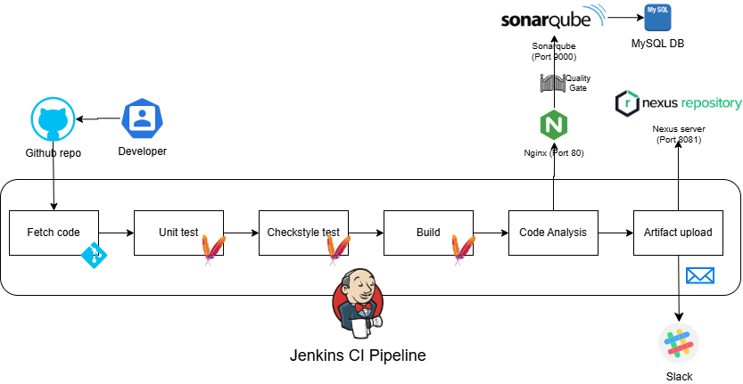

# Jenkins CI/CD Lab with SonarQube, Nexus, and Slack Integration

## Overview

This repository provides a complete, reproducible lab for setting up a **Continuous Integration (CI) pipeline** for a Java Maven application using Jenkins. The pipeline automates testing, code quality checks, static analysis, artifact publishing, and team notifications — all in a fully virtualized environment.

The infrastructure consists of three virtual machines provisioned with **Vagrant**:
- **Jenkins** – CI server
- **SonarQube** – Code quality analysis (with MySQL and Nginx reverse proxy)
- **Nexus** – Artifact repository

### Workflow

1. Developer pushes code to a GitHub repository.
2. Jenkins fetches the latest code.
3. Executes **unit tests** with Maven.
4. Runs **Checkstyle** analysis.
5. Builds the application (`mvn install -DskipTests`).
6. Performs **static code analysis** using SonarQube.
7. Waits for the **SonarQube Quality Gate** – the build fails if quality standards are not met.
8. On success, uploads the `.war` artifact to **Nexus Repository**.
9. Sends a **Slack notification** with the build result (success or failure).

This setup ensures high code quality, early issue detection, and centralized artifact management.

### Tools & Technologies

| Tool              | Purpose                                      | Why It's Used                              |
|-------------------|----------------------------------------------|--------------------------------------------|
| Jenkins           | CI orchestration & Pipeline as Code          | Flexible, plugin-rich, industry standard    |
| Maven             | Build, test, dependency management           | Default tool for Java projects             |
| SonarQube         | Static code analysis & quality gates         | Deep insights into bugs, vulnerabilities, code smells |
| MySQL        | Database for SonarQube                       | Officially supported backend               |
| Nginx             | Reverse proxy for SonarQube                  | Clean external access and security         |
| Nexus OSS         | Maven artifact repository                    | Secure storage and versioning of builds    |
| Vagrant           | VM provisioning                              | Fast, reproducible local environment       |
| VirtualBox        | VM provider                                  | Free and reliable                          |
| Slack             | Build notifications                          | Instant team feedback                      |
| GitHub            | Source code hosting                          | Standard version control                   |

### Key Jenkins Plugins
- Nexus Artifact Uploader
- SonarQube Scanner
- Pipeline Maven Integration
- Build Timestamp
- Pipeline Utility Steps
- Slack Notification

### Service Access (After Vagrant Provisioning)

| Service     | Private IP         | Access URL                            | Notes / Default Credentials                  |
|-------------|--------------------|---------------------------------------|----------------------------------------------|
| Jenkins     | 192.168.33.13     | http://192.168.33.13:8080            | Initial password shown during provisioning  |
| SonarQube   | 192.168.33.12     | http://192.168.33.12 (port 80 via Nginx) | Default: admin / admin (change immediately) |
| Nexus       | 192.168.33.11     | http://192.168.33.11:8081            | Default: admin / admin123 (check logs)      |

### Integrations Overview
- **Jenkins → SonarQube**: Analysis via SonarQube Scanner; Quality Gate enforcement.
- **Jenkins → Nexus**: Artifact upload using Nexus Artifact Uploader with stored credentials.
- **Jenkins → Slack**: Colored status notifications sent to configured channel.
- **Jenkins → GitHub**: Automatic code checkout from public repository.

### Getting Started
1. Begin with **[vagrant.md](./vagrant.md)** to provision the three VMs.
2. Follow the individual guides for each tool:
   - [jenkins.md](./jenkins.md)
   - [sonarqube.md](./sonarqube.md)
   - [nexus.md](./nexus.md)
   - [slack.md](./slack.md)

Each guide includes detailed steps, configuration snippets, verification instructions, and relevant screenshots.

Enjoy building a robust CI pipeline! 🚀
