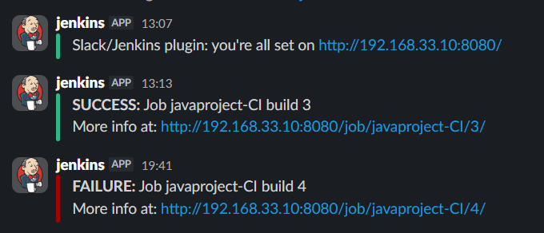

# Slack Integration and Notification Verification

This guide explains how to configure **Slack** notifications in Jenkins, set up an Incoming Webhook, and verify that build status messages are correctly sent from the Jenkins pipeline.

Slack notifications are sent in the **post** section of the pipeline for every build (success or failure).



## Create a Slack Incoming Webhook

1. Go to https://api.slack.com/apps and sign in to your workspace.
2. Click **Create New App** → **From scratch**.
3. Name the app (e.g., `Jenkins-CI`) and select your workspace.
4. After creation, go to **Features → Incoming Webhooks**.
5. Toggle **Activate Incoming Webhooks** to On.
6. Click **Add New Webhook to Workspace**.
7. Choose the target channel (e.g., `#all-m7md` or any channel the app can post to).
8. Click **Allow**.
9. Copy the generated **Webhook URL** (it will look like `https://hooks.slack.com/services/TXXXXXXX/BXXXXXXX/XXXXXXXXXXXXXXXXXXXXXXXX`).

## Configure Slack in Jenkins

There are two common ways to configure Slack notifications. This lab uses the built-in `slackSend` step with a webhook credential.

### Option 1: Global Slack Configuration (Recommended for Multiple Jobs)

1. In Jenkins: **Manage Jenkins → System** (or search for "Slack" in Configure System).
2. Scroll to **Slack** section.
3. Set:
   - **Team Domain**: (leave blank or your workspace subdomain if required)
   - **Base URL**: Leave default (`https://slack.com`)
   - **Default Channel**: `#all-m7md` (including the #)
4. Add the Webhook as a credential:
   - Click **Add** next to "Integration Token Credential".
   - Kind: **Secret text**
   - Secret: Paste the full Webhook URL
   - ID: (optional, e.g., `slack-webhook`)
   - Description: `Slack Webhook for Jenkins`
5. Select the newly created credential in the dropdown.
6. Test the connection if available.

### Option 2: Pipeline-Specific (Using Credential Binding)

If you prefer not to use global config, bind the webhook in the pipeline:

```groovy
withCredentials([string(credentialsId: 'slack-webhook', variable: 'WEBHOOK')]) {
    slackSend(channel: '#all-m7md', token: "${WEBHOOK}", ...)
}
```

The provided `Jenkinsfile` uses the global configuration and direct channel specification.

## Pipeline Slack Notification Code

The notification is defined in the `post` block:

```groovy
def COLOR_MAP = [
    'SUCCESS': 'good',
    'FAILURE': 'danger',
]

post {
    always {
        echo 'Slack Notifications.'
        slackSend channel: '#all-m7md',
            color: COLOR_MAP[currentBuild.currentResult],
            message: "*${currentBuild.currentResult}:* Job ${env.JOB_NAME} build ${env.BUILD_NUMBER}\nMore info at: ${env.BUILD_URL}"
    }
}
```

- **good** = Green message (success)
- **danger** = Red message (failure)
- Message includes job name, build number, status, and link to Jenkins build.

## Verify Slack Notifications

1. Trigger a Jenkins pipeline run (manually or by pushing code).
2. Watch the Slack channel `#all-m7md`:
   - On **success**: Green-bordered message with "SUCCESS" and build link.
   - On **failure** (e.g., force a test failure): Red-bordered message with "FAILURE".
3. Click the build URL in Slack to go directly to the Jenkins console output.

Your entire documentation set is now complete and consistent! 🚀

If you need anything else (e.g., updates, a summary, or repo tips), just let me know.
