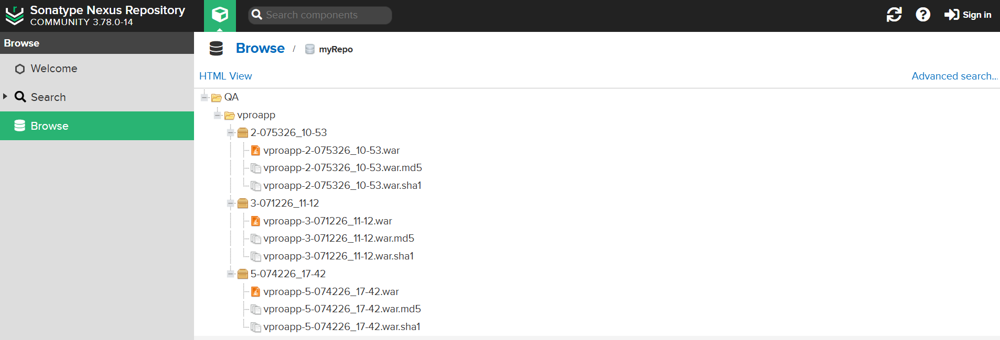

# Nexus Repository Manager Setup

This guide covers accessing **Nexus Repository Manager**, performing initial login, changing default credentials, creating a Maven-hosted repository, and verifying artifact uploads from the Jenkins pipeline.

Nexus is accessible at: **http://192.168.33.11:8081**



## Initial Access and Login

1. Open your browser and navigate to `http://192.168.33.11:8081`
2. Log in with the default credentials:
   - **Username**: `admin`
   - **Password**: `admin123`
3. On first login, Nexus will prompt you to change the admin password.
   - Set a strong new password and complete the setup wizard (you can skip anonymous access configuration for this lab).

## Create a Maven-Hosted Repository

The Jenkins pipeline uploads artifacts to a repository named `myRepo`. Create it as follows:

1. After logging in, click the **gear icon** (Administration) → **Repository → Repositories**.
2. Click **Create repository**.
3. Select **maven2 (hosted)**.
4. Configure:
   - **Name**: `myRepo` (must match exactly)
   - **Version policy**: Release
   - **Layout policy**: Strict
   - (Leave other settings default)
5. Click **Create repository**.

This repository will store the built `.war` files from the pipeline.

## Configure Permissions (Optional but Recommended)

By default, the `admin` user has full access. For tighter security:

1. Go to **Security → Users** or **Roles**.
2. Ensure the user used for uploads (e.g., `admin`) has `nx-repository-view-maven2-myRepo-*` privileges.

In this lab, the default `admin` account is used via the `nexuslogin` credential in Jenkins.

## Verify Artifact Upload

After a successful Jenkins pipeline run:

1. In Nexus, go to **Browse** → select `myRepo`.
2. You should see an entry like:
   - Group: `QA`
   - Artifact: `vproapp`
   - Version: `<BUILD_ID>-<BUILD_TIMESTAMP>`
   - File: `vprofile-v2.war`
3. Click on the artifact to view details or download it.

The pipeline uses:

```groovy
nexusArtifactUploader(
    nexusVersion: 'nexus3',
    protocol: 'http',
    nexusUrl: '192.168.33.11:8081',
    groupId: 'QA',
    version: "${env.BUILD_ID}-${env.BUILD_TIMESTAMP}",
    repository: 'myRepo',
    credentialsId: 'nexuslogin',
    artifacts: [
        [artifactId: 'vproapp',
         file: 'target/vprofile-v2.war',
         type: 'war']
    ]
)
```

**Note**: The original Jenkinsfile uses `192.168.1.15:8081`. Update it to `192.168.33.11:8081` to match your Vagrant setup, or adjust the Nexus VM IP accordingly.

## Important Notes

- The `nexus.sh` script:
  - Installs Amazon Corretto JDK 17
  - Downloads and extracts Nexus 3.78
  - Creates a `nexus` user and systemd service
  - Starts Nexus on port 8081
- In production:
  - Enable HTTPS
  - Disable anonymous access
  - Use strong credentials
  - Backup the Nexus data directory (`/opt/nexus/sonatype-work`)

## Troubleshooting

- If uploads fail: Check Jenkins console log for authentication or URL errors.
- Confirm Nexus is running: `systemctl status nexus` on the Nexus VM.
- View Nexus logs: `/opt/nexus/sonatype-work/nexus3/log/nexus.log`

Next: Proceed to **[slack.md](./slack.md)** for Slack notification configuration and verification.
