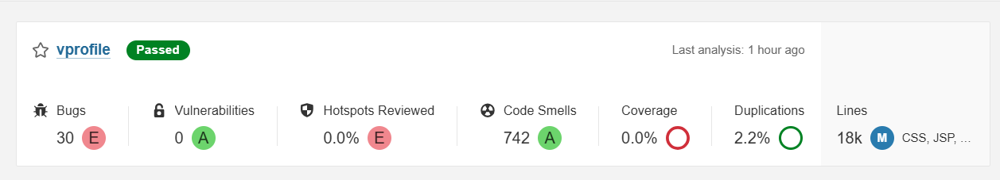

# SonarQube Setup and Configuration

This guide details the post-provisioning steps for **SonarQube**: accessing the server, initial login, changing default credentials, creating a project, generating an authentication token, and setting up a basic Quality Gate.

SonarQube is accessible at: **http://192.168.33.12** (served via Nginx on port 80)



## Initial Access and Login

1. Open your browser and navigate to `http://192.168.33.12`
2. Log in with the default credentials:
   - **Username**: `admin`
   - **Password**: `admin`
3. You will be prompted to change the password immediately.
   - Set a strong new password (e.g., `admin123` or stronger — recommended to change from defaults in production).

## Create a Project

1. After logging in, click **Create Project** → **Manually**.
2. Configure the project:
   - **Project key**: `vprofile`
   - **Display name**: `vprofile`
   - **Branch name**: `main` (or leave default)
3. Click **Set Up**.
4. Choose **Locally** (since we're using the SonarQube Scanner in Jenkins).
5. Note the generated commands — they will be similar to what is used in the Jenkins pipeline:

```bash
${scannerHome}/bin/sonar-scanner \
  -Dsonar.projectKey=vprofile \
  -Dsonar.sources=src/ \
  -Dsonar.host.url=http://192.168.33.12 \
  -Dsonar.login=<your-token>
```

The pipeline already includes these parameters.

## Generate Authentication Token

1. Go to **My Account → Security** (top-right user menu → My Account → Security tab).
2. Enter a name for the token (e.g., `jenkins-token`).
3. Click **Generate**.
4. Copy the token — it will be used in Jenkins configuration.

### Add Token to Jenkins
- In Jenkins: **Manage Jenkins → Credentials → System → Global credentials**
- Add → **Secret text**
  - Secret: Paste the generated token
  - ID: Optional (the `withSonarQubeEnv('sonarserver')` block uses the server configuration)
- Alternatively, the server configuration in Jenkins (see [jenkins.md](./jenkins.md)) references this token if bound.

## Quality Gate Configuration

SonarQube comes with a default **Sonar way** Quality Gate.

To verify or customize:

1. Go to **Quality Gates** (left menu).
2. Select **Sonar way** (default).
3. It typically fails on:
   - Bugs > 0
   - Vulnerabilities > 0
   - Code Smells (maintenance rating)
   - Coverage < 80% (on new code)
   - Duplications > 3%

The pipeline includes:

```groovy
stage("Quality Gate") {
    timeout(time: 1, unit: 'HOURS') {
        waitForQualityGate abortPipeline: true
    }
}
```

This stage will **fail the build** if the Quality Gate status is not `OK`.

## Verification

1. After a successful Jenkins pipeline run:
   - Return to SonarQube dashboard.
   - Click on the `vprofile` project.
   - View issues, coverage, duplications, and Quality Gate status.
2. The dashboard should reflect the latest analysis from the pipeline.

## Important Notes

- The `sonarqube.sh` script configures:
  - PostgreSQL backend with user `sonar` and password `admin123`
  - Nginx reverse proxy listening on port 80 → forwards to SonarQube on 9000
  - Increased system limits for performance
- In production, secure Nginx with HTTPS and restrict access.
- Always change default passwords and tokens.

Next: Proceed to **[nexus.md](./nexus.md)** for Nexus Repository setup and artifact verification.
